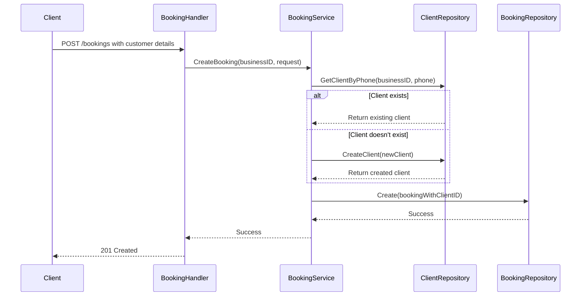

# Client Integration Design Document

## 1. Overview

This document outlines the design for integrating client management into the booking system. The system will now use a dedicated `clients` table to store client information, and bookings will reference clients via foreign key relationships. When creating a booking, if a client doesn't exist for the provided phone number, the system will automatically create a new client record.

## 2. Architecture

The implementation follows the existing Clean Architecture pattern with the following layers:

- **Domain Layer**: Contains the `Client` entity and `ClientRepository` interface
- **Repository Layer**: Implements the `ClientRepository` interface with PostgreSQL operations
- **Usecase Layer**: Updates the `BookingService` to handle client creation and lookup
- **Handler Layer**: Updates the booking endpoints to work with the new client-based approach
- **DTO Layer**: Updates request/response DTOs to align with the new client model

## 3. Data Models

### 3.1 Client Entity

```go
type Client struct {
    ID        string    // UUID
    BusinessID string   // UUID of the business the client belongs to
    FirstName string
    LastName  string
    Email     string
    Phone     string    // Unique within business
    CreatedAt time.Time
    UpdatedAt time.Time
}
```

### 3.2 Updated Booking Entity

```go
type Booking struct {
    ID        string    // UUID
    ServiceID string    // UUID
    StaffID   string    // UUID
    ClientID  string    // UUID (references clients table)
    StartAt   time.Time
    EndAt     time.Time
    CreatedAt time.Time
    UpdatedAt time.Time
}
```

### 3.3 Database Schema Changes

The migration has already been applied with the following changes:
- Created `clients` table with business_id foreign key
- Removed `customer_name` and `customer_email` columns from `bookings` table
- Added `client_id` foreign key column to `bookings` table

## 4. Repository Layer

### 4.1 ClientRepository Interface

```go
type ClientRepository interface {
    CreateClient(ctx context.Context, client *Client) error
    GetClientByID(ctx context.Context, clientID string) (*Client, error)
    GetClientByPhone(ctx context.Context, businessID, phone string) (*Client, error)
    UpdateClient(ctx context.Context, client *Client) error
    DeleteClient(ctx context.Context, clientID string) error
}
```

### 4.2 Implementation Requirements

A new `client_repository.go` file needs to be created in the `internal/repository` directory with PostgreSQL implementation of the above interface.

## 5. Business Logic Layer

### 5.1 Updated BookingService

The `BookingService` needs to be updated with the following changes:

1. Add client repository dependency:
```go
type BookingService struct {
    bookingRepo domain.BookingRepository
    serviceRepo domain.ServiceRepository
    staffRepo   domain.StaffRepository
    clientRepo  domain.ClientRepository  // New dependency
}
```

2. Update constructor to accept client repository:
```go
func NewBookingService(
    bookingRepo domain.BookingRepository,
    serviceRepo domain.ServiceRepository,
    staffRepo domain.StaffRepository,
    clientRepo domain.ClientRepository) *BookingService {
    // ...
}
```

3. Modify `CreateBooking` method to:
   - Look up client by phone number within the business
   - Create new client if not found
   - Associate booking with client ID instead of storing customer name/email directly

### 5.2 Client Creation Logic

When creating a booking:
1. Extract phone number from request
2. Search for existing client with that phone number in the same business
3. If found, use existing client ID
4. If not found, create new client with provided details
5. Associate booking with client ID

## 6. API Layer

### 6.1 Updated CreateBooking Endpoint

The existing POST `/api/v1/businesses/{businessID}/bookings` endpoint will be modified:

#### Request Body
```json
{
  "service_id": "uuid",
  "staff_id": "uuid",
  "start_at": "timestamp",
  "customer_phone": "string",
  "customer_name": "string",
  "customer_email": "string"
}
```

#### Response Body
```json
{
  "id": "uuid",
  "service_id": "uuid",
  "service_name": "string",
  "staff_id": "uuid",
  "staff_name": "string",
  "start_at": "timestamp",
  "end_at": "timestamp",
  "client_id": "uuid",
  "created_at": "timestamp",
  "updated_at": "timestamp"
}
```

### 6.2 Updated GetBookings Endpoint

The existing GET `/api/v1/businesses/{businessID}/bookings` endpoint will return client information through joins with the clients table.

## 7. Data Flow



## 8. Implementation Steps

1. Create `internal/repository/client_repository.go` with PostgreSQL implementation
2. Update `internal/usecase/booking_service.go`:
   - Add client repository dependency
   - Modify constructor
   - Update `CreateBooking` method to use client repository
3. Update `internal/server/handlers/booking_handler.go` if needed
4. Update `internal/dto/booking.go` if needed for response structure
5. Update dependency injection in `cmd/api/main.go` to provide client repository to booking service

## 9. Testing

Unit tests need to be updated/created for:
- Client repository implementation
- Updated booking service logic
- Client creation scenarios (new client, existing client)
- Edge cases (invalid phone numbers, duplicate clients, etc.)

Integration tests should verify:
- Complete booking creation flow with client creation
- Booking creation with existing client
- Proper error handling